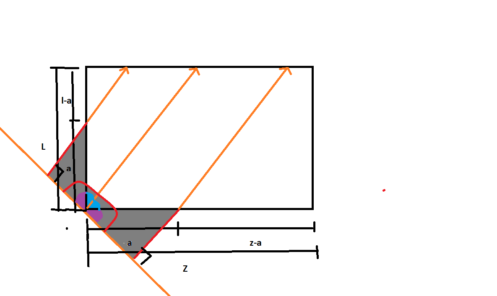
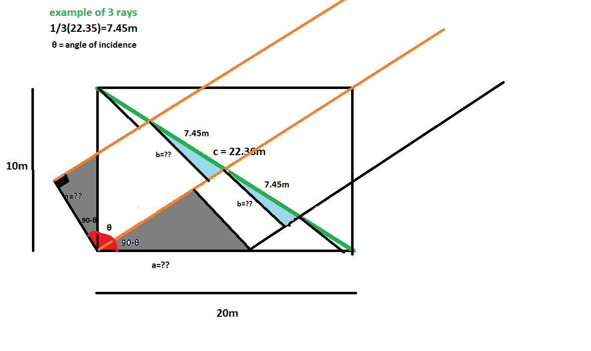

# Evolutionary Steps

## Overview
Initially solving this issue in **2D** will be simpler than in **3D**, and it's easier to conceptualize. Once the 2D design is developed, we can evolve it to 3D. All of this assumes an empty room. The last stage will be to consider obstructions inside the room.

### Mock Scenario
2D — Noise can only propagate from one edge.


## Key Assumptions
- 2D room
- Empty room
- 0° ≤ θ < 180°
- θ is the direction the wavefront is propagating
- Noise is periodic

---

## How Can We Find the Direction of the Wave?

### System 1: Phased Array of Microphones

- We have an array of microphones.
- Depending on the angle, the wavefront will hit one mic first.
- **Goal**: Choose a delay for each mic so the wave can be summed into a much larger signal.


### Delay 

$$
\text{Phase Shift between mics}=\Delta \phi = \omega \cdot \Delta t 
$$
$$
\text{Time Delay Between Mics}=\Delta t = \frac{L}{v}
$$`
$$
  \text{Distance Delay}= L = d\sin(\theta)
$$

$$
\text{Angular Frequency}=\omega = 2 \pi f
$$
$$
\Delta \phi = 2 \pi f \cdot \frac{d\sin(\theta)}{v}
$$

We can see here that phase delay $\propto$
1. frequency of the intruding sound wave
2. distance between mics
3. Incident angle

### Solving for Angle of Arrival (θ)

For our algorithm, we need $\theta$ so if we use algebra we can see that:

$$
\theta = \arcsin(\frac{\Delta \phi v}{2 \pi fd})
$$

### Phase Delay Scanning in a Phased Array System

**If we give the phased array (PA) the correct phase delay**,  
the summation of the raw audio input from the first microphone  
and the phase-shifted signal from the second microphone  
will result in **maximum constructive interference**.

---

However, if we **do not know the correct angle of arrival**,  
we can **iterate through all possible phase delays** and measure the result of each summation.

$$
\text{Summation} = \sum_{i=1}^{n} a_{1n} + a_{2(n+\Delta\phi)}
$$
where:  
$n$ = point in sample  
$a_{1n}$ = amplitude of wave from mic 1 at n   
$ a_{2(n+\Delta\phi)}$= amplitude of wave from mic 2 at a phas delayed location 

> **NOTE:**  
> By limiting the range of phase delays we scan,  
> we can effectively **block or suppress noise from certain angles**,  
> allowing for directional listening or filtering.

---

### Output: Phase Scan Chart

The result of this process is a **chart** where:

- **X-axis** = Phase delay (in radians or degrees)  
- **Y-axis** = Magnitude or power of the summed signal

The **highest peak on this chart** represents the **optimal phase delay**,  
which corresponds to the actual **direction of the incoming sound**.

This peak tells us the **angle of arrival** that best aligns the signals.

---

We can use this in our algorithm and compute theta efficiently once the correct phase delay is given.

### Pseudocode
1. Get audio sample from mics
2. Scan for optimal phase delay
3. Compute $\theta$
4. Output Steering Angle Chart


### Expanding to 3D

We can run two of these systems on 3 mics one calculating for the horizontal angle $\theta$ and elevelation $\phi$

Convert to 3D:
$$
\vec{\text{Direction of Intruding Noise}} =
\begin{bmatrix}
\sin(\phi) \cos(\theta) \\
\sin(\phi) \sin(\theta) \\
\cos(\phi)
\end{bmatrix}
$$


## Sinusilence — Acoustic Cancellation System


### Receiver Side:
- Two microphones 
- LNA filters out frequencies outside of human hearing and very quiet noises

### Transmit Side:
- Transmit a 50 Hz sine wave

---

## Given:
- Frequency = 50 Hz  
- Wavelength λ = v / f = 343 m/s / 50 Hz = 6.86 m  
- ½ λ = 3.43 m  
- System works best when mic spacing = ½ λ

---


## 2D Room — Optimal Microphone Locations

### Objective
Minimize the area affected by intruding noises in a quadrilateral room.


- Arrows show sound propagation direction.
- Black dots = microphones.
- Sound waves moving **perpendicular to an edge** won't enter the room no matter the orientation of microphones on a particular edge closes to source.
- When propagation angle shifts from 90 degrees to a more acute angle, some sound leaks in before the system reacts.

---


### Observations
- We only consider a two element phased array to be closest to right vertex
- The red wavefront came from the left and the highlighted pink area shows how much area it travels over before it can be detected by current system.
- Adding mics on the opposite side (left) can prevent leakage.

---


### Key Insight
- When sound comes from the same quadrant, no new mics are needed.
- **45° angle** from a vertex causes the most leakage.
- Use this to guide testing.

### Note on Flat Wavefront Assumption:
- Gray area beyond the purple box = zone where flat wavefronts are expected.
- Closer sources may have spherical wavefronts, which cause more leakage.
- Using Fraunhofer Distance (D = 2a² / λ), we see the source must be very close to break flat assumption.
- Convention in acoustics assumes **urban noise = flat wavefront**.

---

## Problem from Other Quadrants

- Brown wavefront from another quadrant shows major leakage.
- If no mics are placed in that quadrant, system won’t respond in time.


**Conclusion:** You need **two mics per corner** of a 2D room.

---

# Part 2: Cancellation noise

The cancellation noise will simply be the inverse of the recieved noise signal.

## Finding Optimal Speaker Orientation

The first design that came to mind was placing 4 speakers at the middle of each edge. 


Green Circle = Phased Array
Orange Rectangles = Speakers
Black Arrow = Intruding Noise

Just from looking at it one might be able to see that in the worst case the user can be right up against the wall in which the intruding noise intial penetrates through.
In this case I do not see a senario where we could possibly intercept it in time. However. If we understand how "late" our inverse wave will be we can shift it properly so that although it is late it will be in phase with the intruding noise.

## 🧮 Latency Analysis Formula

To determine if anti-noise can effectively cancel an intruding sound, we compare the time it takes for the noise to reach the listener with the time it takes for our system to detect and respond.

### ✅ Net Latency Formula

**Latency** = **Intruding Propagation Time** − **System Response Time**

**Latency** =  *t<sub>intrude</sub>* − (  *t<sub>mic</sub>* + *t<sub>beamform</sub>*+  *t<sub>generate</sub>* + *t<sub>speaker</sub>*+ *t<sub>inverse</sub>*  )

---

### 📘 Definitions:

- **t<sub>intrude</sub>**: Time for the intruding sound to reach the listener  
  - *t<sub>intrude</sub>* = *d<sub>listener</sub>* / *v*

- **t<sub>mic</sub>**: Microphone hardware delay  
- **t<sub>beamform</sub>**: Time to compute direction of arrival  
- **t<sub>generate</sub>**: Time to generate the anti-noise signal  
- **t<sub>speaker</sub>**: Speaker output delay  
- **t<sub>inverse</sub>**: Time for the anti-noise to reach the listener  
  - *t<sub>inverse</sub>* = *d<sub>spk</sub>* / *v*


### ✅ Decision Logic

- If **Latency > 0** → Emit anti-noise normally ✅  
- If **Latency < 0** (e.g., within half a wave period) → Emit with phase shift ⚠️ 
--- 

Now we have effectively solved how we can deal with the worst cases However, I am quite curious to see how bad the worse cases are.

# 🧪 Worst-Case Latency vs. Mic/Speaker Count 

We can test the worst case by considering when the intruding noise reaches the user the fastest and is farthest from the speaker. the inverse noise takes t senario where the user is at the maximum distance from a speaker while being the closest to the intruding noise. This must take place on the edge.

# 🔊 Worst-Case Latency vs. Speaker Count (10m Wall)

## Room Setup:
- Wall length: 10 meters
- Intruding noise enters from an edge of the wall
- Listener is positioned **right at the edge**, closest to intrusion
- Speakers are evenly spaced along the wall

## Constants:
- Speed of sound (v): **343 m/s**
- Fixed system delays (excluding propagation):  
**System Time** =    *t<sub>mic</sub>* + *t<sub>beamform</sub>*+  *t<sub>generate</sub>* + *t<sub>speaker</sub>*+ *t<sub>inverse</sub>*  

---

## 📊 Latency Table

# 🔊 Corrected Worst-Case Latency vs. Speaker Count (10m Wall)

| # of Speakers | Segment Count | Spacing (m) | Max Dist to Speaker (m) | Inverse Propagation Time (ms) | Total System Time (ms) | Latency (ms)  |
|---------------|----------------|-------------|--------------------------|-------------------------------|-------------------------|---------------|
| 1             | 1              | 10.00       | 5.00                     | 14.58                          | 17.08                   | -16.11        |
| 2             | 3              | 3.33        | 1.67                     | 4.87                           | 7.37                    | -6.40         |
| 3             | 4              | 2.50        | 1.25                     | 3.65                           | 6.15                    | -5.18         |
| 4             | 5              | 2.00        | 1.00                     | 2.92                           | 5.42                    | -4.45         |

> Inverse Propagation Time = (Max Distance) / 343 × 1000  
> Latency = 0.97 ms (intruding wave delay from 1/3 m away) − Total System Time

As we can see even with 4 mics the delay is estimated at 4.4.5ms. However by using parrallel program we can reduce it to ~1ms. This would make the delay almost very hard to pickup on. 

## Handling Reflections

Last but not easiest,  we can  intercept the noise by sending the noise cancellation sound from the optimal speaker location however. the optimal speaker location is defined as oen that is closest to the user which in turns lowers the latency of the system. However this location since it is not at the same angle as the intruding noise means we also haev to worry about cancelling its reflections along with the intruding noise. This may seem complicated but if we are able to cancel one noise we can just apply the same method to multiple.

Given: the original angle and the loudness. 
Output: 

We will tackle this in the following steps:
1. Calculate Loudness as a function of distance traveled by sound wave.
- If the loudness is below threshold before reaching another wall stop
2. Calulate Loudness after reflection
3. Repeat Step 1

Now if it will never hit the user than it doesnt really matter 

## 1. 📉 Loudness Decrease Over Distance

In free space (with no reflections), sound intensity decreases with the square of the distance. This is known as the **inverse square law**.

The **loudness in decibels** at a given distance can be calculated as:

**L<sub>r</sub> = L<sub>0</sub> - 20 &middot; log<sub>10</sub>(r / r<sub>0</sub>)**

Where:

- **L<sub>r</sub>** = Loudness at distance `r` (in dB)  
- **L<sub>0</sub>** = Loudness at reference distance r<sub>0</sub> (in dB)  
- **r** = Distance from the source (in meters)  
- **r<sub>0</sub>** = Reference distance (usually 1 meter)  

> 🔁 Every time the distance **doubles**, the loudness drops by approximately **6 dB**.

### 🧪 Example

If a sound is 80 dB at 1 meter, the loudness at 2 meters is:

**L<sub>2</sub> = 80 - 20 &middot; log<sub>10</sub>(2 / 1) = 80 - 6.02 ≈ 74 dB**

We need to compute the direction of the reflected sound wave until the amplitude is negligible. 

## 📉 2. Loudness After Reflection

When a sound wave reflects off a surface, part of its energy is lost depending on the surface's properties. This affects both its **intensity** and **perceived loudness**.

### 1. Calculating Sound Intensity from Pressure Amplitude

If you have the pressure amplitude of a sound wave (e.g., from a microphone), you can calculate its intensity using:
$$
I = \frac{p_{\text{rms}}^2}{\rho v}
$$
Where:
- $( I $) = Sound intensity in watts per square meter (W/m²)  
- $( p_{\text{rms}} $) = Root-mean-square sound pressure (Pa)  
- $( \rho $) = Air density (≈ 1.21 kg/m³ at room temperature)  
- $( v $) = Speed of sound in air (≈ 343 m/s)


### 2. Reflected Sound Intensity

The intensity of the reflected sound wave is:

**I<sub>r</sub> = R² · I<sub>i</sub>**

Where:

- **I<sub>r</sub>** = Reflected sound intensity (W/m²)  
- **I<sub>i</sub>** = Incident (original) sound intensity (W/m²)  
- **R** = Reflection coefficient (0 ≤ R ≤ 1), specific to the material

---

### 📊 2. Sound Level in Decibels

The loudness of a sound in decibels (dB) is calculated from its intensity:

**L = 10 · log₁₀(I / I₀)**

Where:

- **L** = Sound level in decibels (dB)  
- **I** = Sound intensity (W/m²)  
- **I₀** = Reference intensity = 10⁻¹² W/m² (threshold of hearing)

---

## Psuedo Code - 2D Solution
```
function trace_ray(theta, start_edge_length, l0, threshold):
    while True:
        # Step 1: Compute distance traveled in this ray segment
        hyp = start_edge_length / cos(theta)
        
        # Step 2: Attenuate loudness over that distance
        l1 = calculate_loudness_after_distance(l0, hyp)
        
        # Step 3: Check if it's still bothersome
        if l1 > threshold:
            # Step 4: Reflect and continue tracing
            r1 = calculate_loudness_after_reflection(l1)
            
            # Step 5: Compute new start edge for next travel
            new_start_edge_length = hyp * sin(theta)  # opp
            
            # Recursive call with updated loudness and edge
            trace_ray(theta, new_start_edge_length, r1, threshold)
            return
        else:
            # Exit if no longer bothersome
            return
```
$$
\text{n = number of reflections before the sound will drop below threshold }
$$
$$
\text{Time complexity} = O(n)
$$
$$
\text{Space Complexity} = O(n) \text{ because of the recursive call. It will add a new stack frame }
$$
```
function trace_ray(theta, start_edge_length, l0, threshold):
    while True:
        # Step 1: Compute distance traveled in this ray segment
        hyp = start_edge_length / cos(theta)
        
        # Step 2: Calculate loudness after distance traveled
        l1 = calculate_loudness_after_distance(l0, hyp)
        
        # Step 3: Check if it's still bothersome
        if l1 > threshold:
            theta = theta
            start_edge_length = sin(theta)*hyp 
            l0=l1
            threshold = threshold
        else:
            # Exit if no longer bothersome
            return
```
$$
\text{n = number of reflections before the sound will drop below threshold }
$$
$$
\text{Time complexity} = O(n)
$$
$$
\text{Space Complexity} = O(1)
$$

Now this program does not account for all rays passing through which can be understood to be the area of the traingle we are repeatedly using for the ray tracing algorithm. 

## Creating Adaption for Finding Entire Wavefront

The reason we are doing is because simply considering a single ray does not express the sound in real life. 

We can track multiple rays in order to track the entire wavefront. 



To calculate for each ray we need the paramters theta, start_edge_length, l0, threshold.

The two variables that will need to be adjusted for each ray is the start_edge_length and l0.

1. Adjusting l0 

  $$
  L_r = L_0 - 20 \log (\frac{r}{r_0})
  $$
Where:

- $L_r$ = Loudness at distance `r` (in dB)  
- $L_0$ = Loudness at reference distance r_0 (in dB)  
- $r$ = Distance from the source (in meters)  
- $r_0$ = Reference distance (usually 1 meter)  

Using the Diagram:

$$
\textbf{If, }
\sin(\theta) = \frac{opp}{hyp}
$$
$$
hyp = a = \text{spacing between rays}
$$

### Feature: Finding Dynamic Assignments to Ray Spacing

#### Discussion




#### Analysis

This value must dynamically change based on the resolution the use wishes to compute. We should investigate the balance of increase resolution on the cancellation effectivness and the runtime of the alg. At first thought this should be run in parrallel so it would only be a concern of how many threads are left to use.

Dividing the diagnol the crosses the room into a value < number of rays will push the edge rays closer to the corner of the room which would be best for representing the largest amount of the wavefront. However keeping the resolution low will also loose the detail of loudness in between the edge rays. 

How can we increase the information between the edge rays without computing them to avoid computation costs? 

$$
\textbf{Then, }
\sin(90^\circ - \text{Angle of Incidence}) = \frac{\text{r}}{a}
$$
$$
\textbf{Therefore, }
\text{r} = \sin(90^\circ - \text{Angle of Incidence}) \cdot (a)
$$
where $a$ is the specified spacing


With this complete we can confidently say we can emulate a wave until it becomes unhearable. However how do we know it is interacting with the person? The better question how do we know it will interact with the person.

## User Positioning System

Computer Vision is not viable beacuse the frame rate of the camera causes a larget delay. For 30FPS the system would not recieve an image to process for 33ms. This delay is too large for our purposes but it would have been nice because the user wouldnt need a location device on them.

We could use the the time of arrival of an array of transmitters to locate the user. These waves should be UWB because the velocity of UWB is close to the speed of light $3\cdot10^8 \text{m/s}$ which would provide latency.

However, I have great ambitions to create a system that can haev global cancellation.

So therefore instead of spending time and money on that system I will make a simple UI where the user can select a spot they wish to havd the noise cancellation applied to given an outline of their apartment. Production wise, this does seem feasible because every apartment in a building is structured the same. We can also place the beamforming at a height that can clear most objects in the room like a sofa, etc. However the higher you place the phased array of speakers the worse the latency gets because of the travel time of the cancellation wave to the person considering they arent spiderman and hanging from the ceiling.
But if we consider the average height around 5ft 8 then most peoples ears when standing are actually closer to the cieling than the floor. I think it would be smart to assert if the person is standing or sitting in the location they wish to cancel to provide better cancellation. Although if we do just use a linear phased array of speakers its projection will look like (insert matlab) making it able to hit all unobstructed heights. Which would make the system less costly than a 3D one and not haev to worry about the sitting standing or hanging off ceiling status of the person. However the height at which the array is placed is critical. We can find the optimal height location by running tests on the latency of the system as height increases from middle of wall to ceiling. 

Given the dimensions of the room we can correspond a cartesian plane to the dimesions and can thus create an (x,z)
we dont need y because of previously mentioned design.

## System Design

### Hardware

The system will use **anchors** which are the transmitters where the location is known.

#### Anchors

The system will need 3 for to compute the postion of the user in the x-z pland(location in room) and an additional one to solve for the xy plant (user height).

For each anchor we can compute

$$
\text{Distance} = c \cdot \Delta t
$$
$c$ is the speed of light 
$\Delta t = \text{time of flight} = \text{time signal was sent} - \text{time signal was recieved}$ 

Given Locations:

Anchor 1 at (x1,y1,z1)
Anchor 2 at (x2,y2,z2)
Anchor 3 at (x3,y3,z3)
Anchor 4 at (x4,y4,z4)

which will give us distances (d1, d2, d3, d4)

Now we can solve this using least squares to find location (x,y,z)

$$
(x - x_1)^2 + (y - y_1)^2 + (z - z_1)^2 = d_1^2
$$
$$
(x - x_2)^2 + (y - y_2)^2 + (z - z_2)^2 = d_2^2
$$
$$
(x - x_3)^2 + (y - y_3)^2 + (z - z_3)^2 = d_3^2
$$
$$
(x - x_4)^2 + (y - y_4)^2 + (z - z_4)^2 = d_4^2
$$

There is a piece of hardware called **DWM1001** that does this excat calculationg in a matter on microseconds. It will also deload the main program and allow for more threads to be used elsewhere. 

## BeamSteering - 2D

Beamsteering will use phase delay in order to steer the sound at a particular angle
$$
\Delta \phi = 2 \pi f \cdot \frac{d\sin(\theta)}{v}
$$

This means that theta would increases from 0(0 deg)to 1(90deg)
Inversely, if we decrease theta to -90 deg it would approach -1.

This would make the phase delay either positive or negative.

## ⚠️ Problem: Negative Phase Delay Is a Problem in Real-Time Processing

In real-time systems, applying **negative phase delay** introduces fundamental issues related to **causality**:

- For the **reference speaker**, a negative phase delay would mean trying to output the signal **before the current time**, but we **do not have access to past (pre-played) samples** in real-time.
  
- For the **last speaker in the array**, a negative delay means we would need to output the signal **before we’ve received it**, i.e., we would require access to a **future sample**, which hasn’t arrived yet.

In both cases, the system would be attempting to **respond to a signal out of the bounds of the sample**, which is not physically realizable in a real-time setup.

> **Negative phase delays violate causality** because they require information from the future or pre-played past — neither of which is accessible in real-time processing.

### ✅ Design Solution

Instead of applying negative phase delays directly:
- **Change the reference speaker** based on steering direction.
- This allows you to apply only **positive phase delays** across the array.
- The relative timing is preserved, and all operations stay **causal**.

Now we have the ability to steer the inverse sound a sound in 2D.

We can efficently create the sound by flipping the signs of all amplitudes in the sample. 

Now we have the ability to steer a cancellation noise.


## Interwining the Location System and the Beamsteering

Overall the wave will first

1. First compute its direction 
2. Will start to trace its wavefront and loudness
3. Track user

In order to properly time the transmission we need to know

1. The distance of the user from the closest speaker array
  - So we can find the $t_\text{inverse}$
2. Find distance of propgating wavefront to user
  - so we can find $t_\text{intruding}$

if $t_\text{inverse}$ <  $t_\text{intruding}$, then apply time delay before emmission

if $t_\text{inverse}$ >  $t_\text{intruding}$, then apply phase shift to noise

For the inverse noise we also must consider loudness ge the intruding loudness and compute the $l_0$ for inverse noise 


