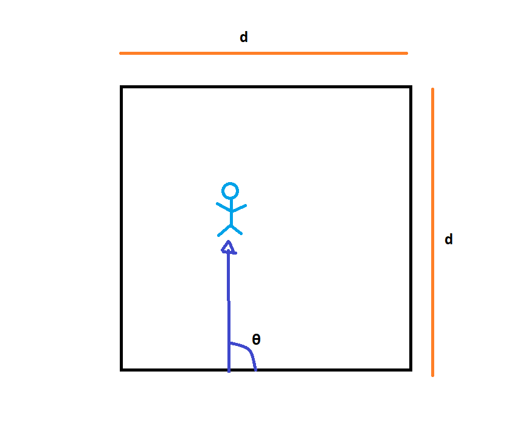
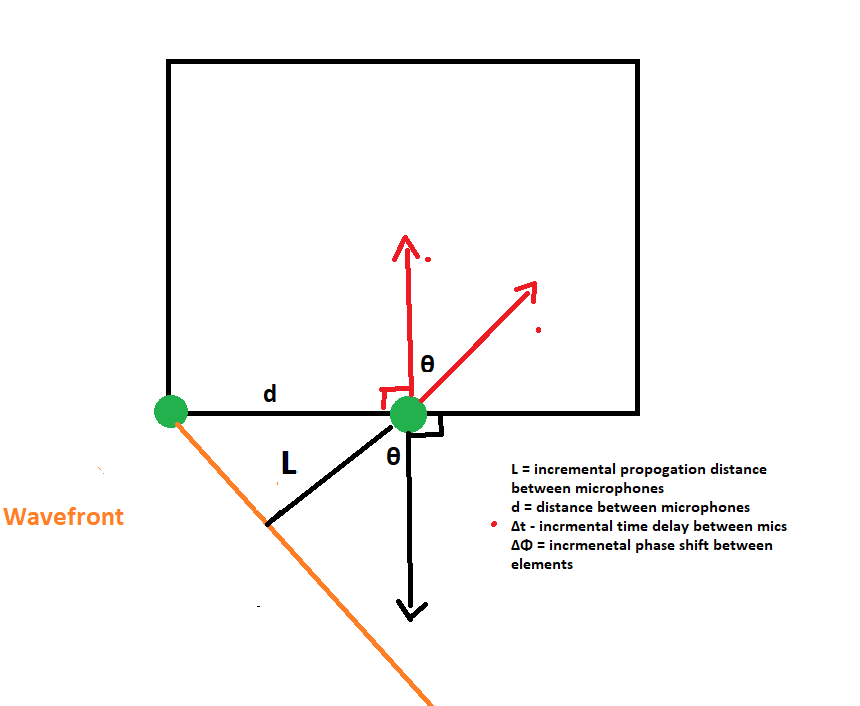
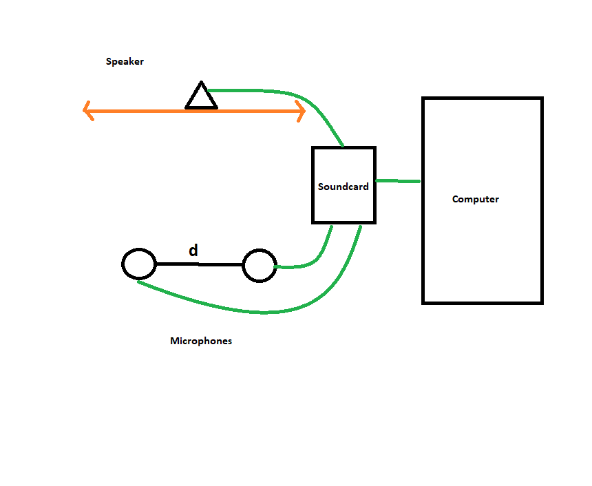
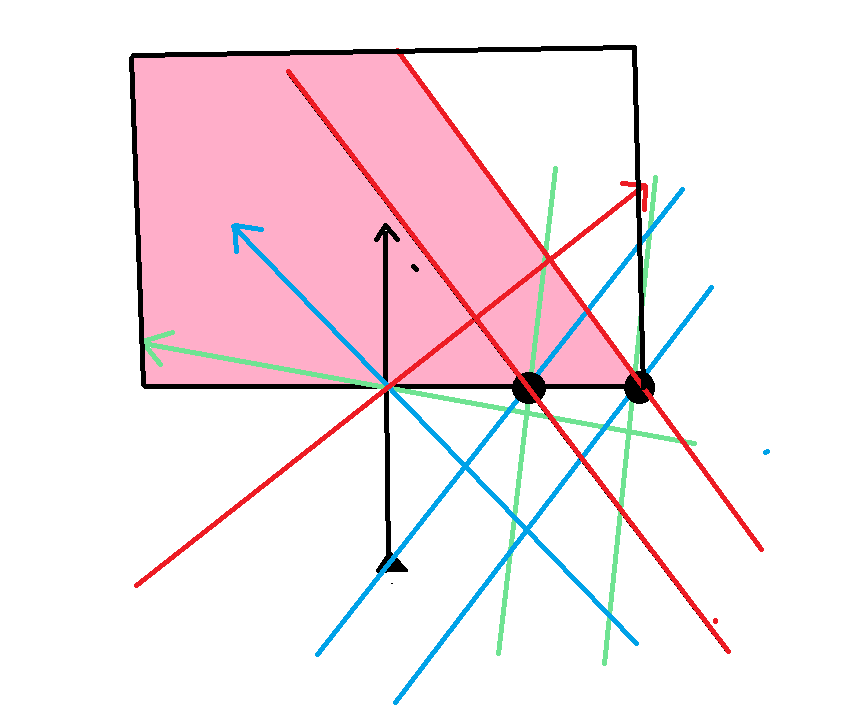
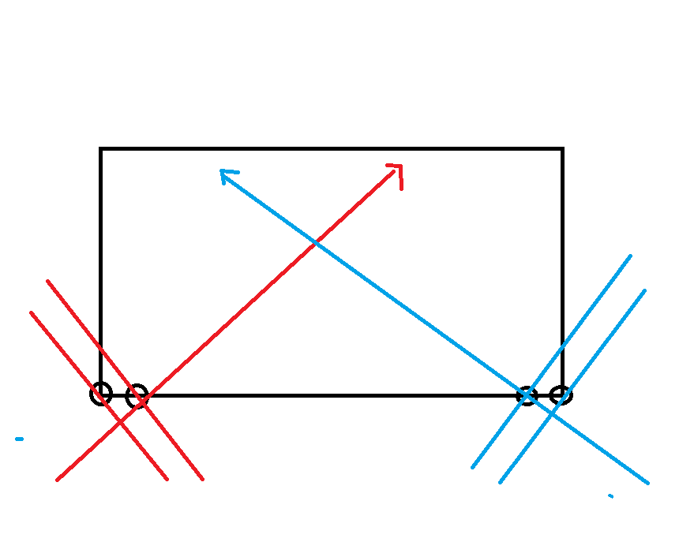
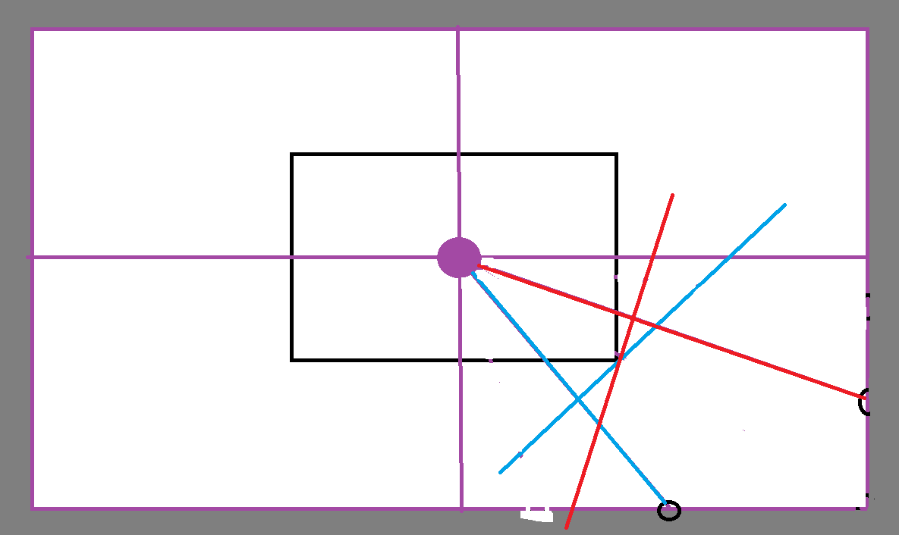
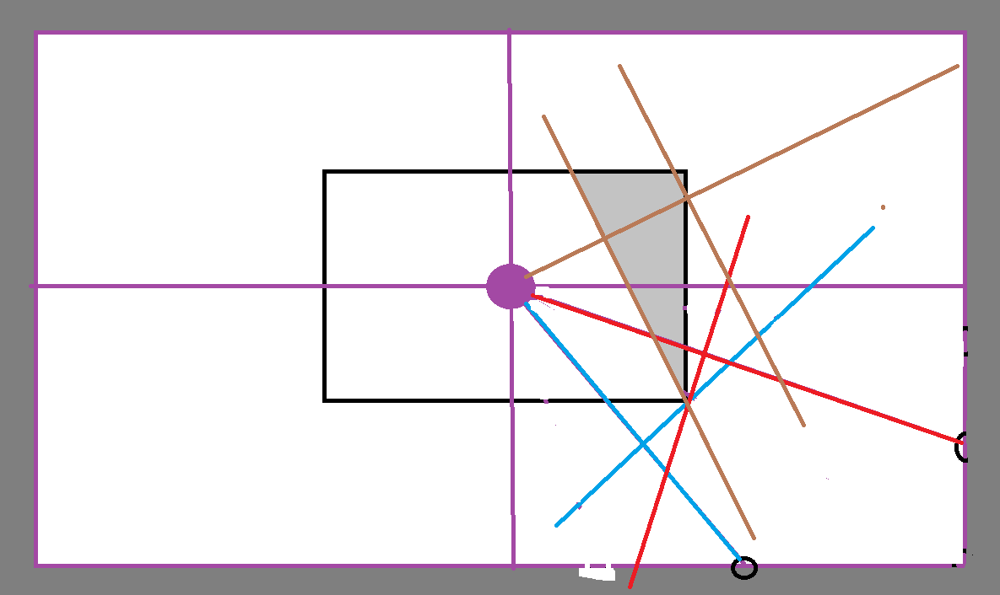

# Evolutionary Steps

## Overview
Initially solving this issue in **2D** will be simpler than in **3D**, and it's easier to conceptualize. Once the 2D design is developed, we can evolve it to 3D. All of this assumes an empty room. The last stage will be to consider obstructions inside the room.

### Mock Scenario
2D — Noise can only propagate from one edge.

## Key Assumptions
- 2D room
- Empty room
- 0° ≤ θ < 180°
- θ is the direction the wavefront is propagating
- Noise is periodic

---

## How Can We Find the Direction of the Wave?

### Phased Microphone Array
- We have an array of microphones.
- Depending on the angle, the wavefront will hit one mic first.
- **Goal**: Choose a delay for each mic so the wave can be summed into a much larger signal.

### Delay 

Phase Delay was used in the development for a system for radio frequencies so I will implement that first.

$$
\text{Phase Shift between mics}=\Delta \phi = \omega \cdot \Delta t 
$$
$$
\text{Time Delay Between Mics}=\Delta t = \frac{L}{v}
$$`
$$
  \text{Distance Delay}= L = d\sin(\theta)
$$

$$
\text{Angular Frequency}=\omega = 2 \pi f
$$
$$
\Delta \phi = 2 \pi f \cdot \frac{d\sin(\theta)}{v}
$$

We can see here that phase delay $\propto$
1. frequency of the intruding sound wave
2. distance between mics
3. Incident angle

### Solving for Angle of Arrival (θ)

For our algorithm, we need $\theta$ so if we use algebra we can see that:

$$
 v  
$$
---
## Experiment 1:

$$
v
$$

### 🎯 Phase Delay Scanning in a Phased Array System

**If we give the phased array (PA) the correct phase delay**,  
the summation of the raw audio input from the first microphone  
and the phase-shifted signal from the second microphone  
will result in **maximum constructive interference**.

---

However, if we **do not know the correct angle of arrival**,  
we can **iterate through all possible phase delays** and measure the result of each summation.

> **NOTE:**  
> By limiting the range of phase delays we scan,  
> we can effectively **block or suppress noise from certain angles**,  
> allowing for directional listening or filtering.

---

### 📈 Output: Phase Scan Chart

The result of this process is a **chart** where:

- **X-axis** = Phase delay (in radians or degrees)  
- **Y-axis** = Magnitude or power of the summed signal

The **highest peak on this chart** represents the **optimal phase delay**,  
which corresponds to the actual **direction of the incoming sound**.

This peak tells us the **angle of arrival** that best aligns the signals.

---

We can use this in our algorithm and compute theta efficiently once the correct phase delay is given.

### Pseudocode
1. Get audio sample from mics
2. Scan for optimal phase delay
3. Compute $\theta$
4. Output Steering Angle Chart

Once this is working, we can move onto how to expand to 3D:

## ADALM-PLUTO (Software-Defined Radio Platform)

### Receiver Side:
- 2 receive ports → Low Noise Amplifier (LNA)
- LNA amplifies the signal while keeping a low noise floor
- Signal is sent to a mixer for 0 Intermediate Frequency (0 IF) processing using a 2.3 GHz Local Oscillator (LO)

### Transmit Side:
- Baseband signal is converted to analog via DAC
- Analog signal is upconverted to RF using the same 2.3 GHz LO
- Signal is transmitted via antenna

---

## Sinusilence — Acoustic Cancellation System

### Receiver Side:
- Two microphones 
- LNA filters out frequencies outside of human hearing and very quiet noises

### Transmit Side:
- Transmit a 50 Hz sine wave

---

## Given:
- Frequency = 50 Hz  
- Wavelength λ = v / f = 343 m/s / 50 Hz = 6.86 m  
- ½ λ = 3.43 m  
- System works best when mic spacing = ½ λ

---

### Phase & Delay Table

| θ (degrees) | ΔΦ (radians) | Δt = d × sin(θ) / 343 (s) | ΔΦ = 2πfΔt (degrees) |
|-------------|----------------|-----------------------------|------------------------|
| 0°          | 0              | 0                           | 0                      |
| 20°         | ≈ 0.34         | (calculate)                 | (calculate)            |
| 30°         |                |                             |                        |
| 45°         |                |                             |                        |
| 60°         |                |                             |                        |
| 75°         |                |                             |                        |
| 90°         |                |                             |                        |

---

## 2D Room — Optimal Microphone Locations

### Objective
Minimize the area affected by intruding noises in a quadrilateral room.

- Arrows show sound propagation direction.
- Black dots = microphones.
- Sound waves moving **perpendicular to an edge** won't enter the room no matter the orientation of microphones on a particular edge closes to source.
- When propagation angle shifts from 90 degrees to a more acute angle, some sound leaks in before the system reacts.

---

### Observations
- We only consider a two element phased array to be closest to right vertex
- The red wavefront came from the left and the highlighted pink area shows how much area it travels over before it can be detected by current system.
- Adding mics on the opposite side (left) can prevent leakage.

---

### Key Insight
- When sound comes from the same quadrant, no new mics are needed.
- **45° angle** from a vertex causes the most leakage.
- Use this to guide testing.

### Note on Flat Wavefront Assumption:
- Gray area beyond the purple box = zone where flat wavefronts are expected.
- Closer sources may have spherical wavefronts, which cause more leakage.
- Using Fraunhofer Distance (D = 2a² / λ), we see the source must be very close to break flat assumption.
- Convention in acoustics assumes **urban noise = flat wavefront**.

---

## Problem from Other Quadrants

- Brown wavefront from another quadrant shows major leakage.
- If no mics are placed in that quadrant, system won’t respond in time.

**Conclusion:** You need **two mics per corner** of a 2D room.

---
We can see that it is possible to find the initial angle of propagation. However, cancelling that noise becomes a lot more difficult.
We can use a concept called beamsteering to direct the inverse cancellation wave wherever we want without nearby people or animals hearing it.
However the major issue is how to setup the system to have complete noise cancellation at the user. WE can easily intercept the noise by sending the nosie cancellation sound from anywhere however, there are ramifications in the form of the reflecting sound waves.

We need to compute the direction of the reflected sound wave until the amplitude is negligible. We know that the angle of reflection is equal to the angle of insicdent. How do we find when the amplitude drops to unhearable levels.

---
